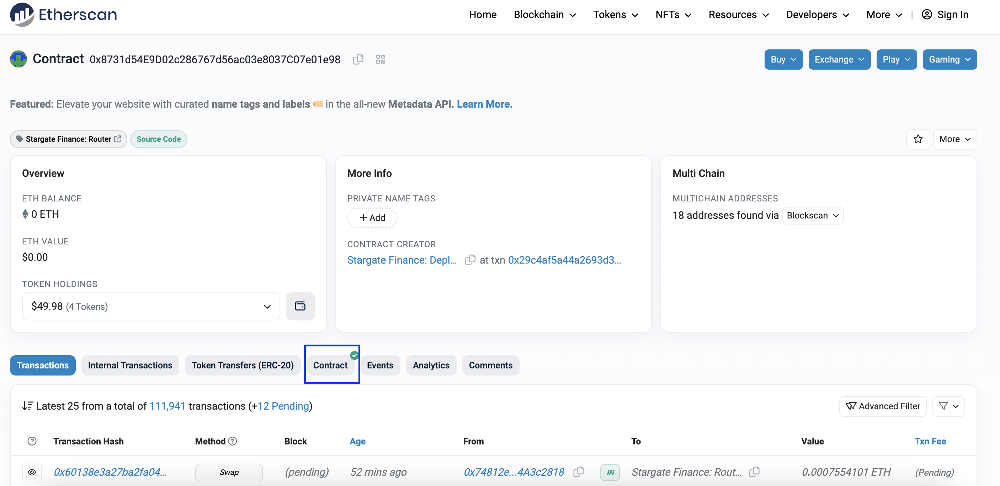

### Why Etherscan?

Cryptocurrency, unlike traditional finance, offers a unique feature - a public ledger. This game-changing trait provides full transparency into every transaction and state change on the blockchain, accessible to all. However, raw on-chain data can be complex to decipher, often requiring extensive processing to make sense out of it.


Enter [Etherscan](https://etherscan.io/), our guide in this intricate world. It translates the raw, complex blockchain data into an easily understandable format, making it an invaluable tool for both blockchain novices and veterans.

Despite Etherscan's intuitive interface, some users can still face challenges in extracting the most value out of it. Fear not, because with this post, I will provide a comprehensive guide on how to effectively navigate the chain using Etherscan, elucidating its interface and making the data comprehensible. So, let's dive in and explore the fascinating world of Ethereum through Etherscan!

### Landing Page


Upon visiting etherscan.io, you'll be greeted by the landing page above. This page is your gateway to Ethereum, offering three major areas to explore:
- **Red Box**: The *Search Bar* allows you to search for information such as addresses, ENS, contracts, transactions, blocks, and tokens.
- **Green Box**: The *Latest Blocks* section displays the most recently mined blocks on Ethereum. Each block contains a collection of validated transactions, and details regarding the blocks such as block number, miner, transactions included, and the time it was mined.
- **Blue Box**: The *Latest Transaction* section shows the most recent transactions that occurred on Ethereum. Each transaction represents an action carried out on the network resulting in a state change. You can find important details such as transaction hash, the status of the transaction, the block in which it was included, the age (time since it was mined), who sent it (from), who received it (to), the value, and the transaction fee.

### Search Bar

The *Search Bar* allows you to search for information such as addresses, ENS, contracts, transactions, blocks, and tokens. Below are some examples that you can experiment with:
```md
# Example of Address
0xd39255c361b5f5ecd64569c07a91b457e529ed5a

# Example of ENS
interncapital.eth

# Example of Contracts (Stargate Router)
0x8731d54E9D02c286767d56ac03e8037C07e01e98

# Example of Transactions
0xd906f30c4191227cee7bc40c05b00f3416bdedf43b5a44e01288de0b79322ec4

# Example of Blocks
18274944

# Example of Tokens (USDC)
0xa0b86991c6218b36c1d19d4a2e9eb0ce3606eb48
```

### Address

Let's begin by searching for an address. You can use my address (0xd39255c361b5f5ecd64569c07a91b457e529ed5a) as an example. Enter it into the search bar and you'll land on a page similar to the one shown below:

This page is like a personal profile for the address, providing useful information such as:
- ENS name
- Eth Balance
- Token Holdings
- Transactions

You can also directly search for ENS names in the search bar. For instance, if you search for "interncapital.eth", it will lead you to the "name lookup search" page as shown below:

From this page, you can see the resolved address tied to the ENS. You can navigate to the address page by clicking on the resolved address value.

### Contract

You can also search for a contract address via the search bar. The fundamental difference between a contract and an address is:
- An address is controlled by a private key (typically created from end-user wallets like Metamask/Rabby)
- A contract is controlled by code (it can be called by an address to perform transactions and actions on the blockchain)


Contract addresses are easily distinguishable on Etherscan. For example, if we look at this contract: 0x8731d54E9D02c286767d56ac03e8037C07e01e98, we can see that the Etherscan UI has a contract tab that differentiates it from a regular address.

### Transaction

Now that we know how to search for an address/contract, let's explore transactions! By going through all the transactions of an address, you can understand all the actions initiated by the address since its creation, including fund transfers and smart contract interactions.

You can start by looking at any of my transactions or search for this specific transaction: 0xd906f30c4191227cee7bc40c05b00f3416bdedf43b5a44e01288de0b79322ec4


Let's break down what this page means:
- Transaction Hash: A unique Hash ID that identifies the specific transaction
- Status: The status of the transaction
- Block: The block number where this transaction was included
- Timestamp: The time when this transaction was executed
- Transaction Action: Displays the result of token movement after the transaction
- From: The address that initiated the transaction
- To: The address that received the transaction (Also shows the flow of ETH here)
- ERC-20 Tokens Transferred: Shows the flow of ERC-20 tokens within this transaction
- Value: The amount of Ethereum used in this transaction
- Transaction fees: The fees incurred to execute this transaction
- Gas Price: The amount of Gwei used in this transaction

Understanding the transaction page and what's happening within a transaction takes time to master. For this transaction, you can rely on the "Transaction Action" to understand what actually happened: interncapital.eth used the Stargate protocol to bridge USDC into the Avalanche chain. From the "To" and "Transaction Fee", we can see that ~$5.23 was spent as gas (transaction fee) and ~$1.04 was spent as a Stargate protocol fee (by looking at the "To", we can see that ~$1.04 was sent to LayerZero)

### Block
You can also search for a block number in the search bar to view a specific block and all the transactions that occurred within it. For this exercise, let's search for "18274944" (which is the block that includes the bridge transaction we looked at in the transaction section). 


You can click on the transactions to check all the 207 transactions that occurred within that block.

To check the position of our bridge transaction within the block, we can go back to the transaction page, expand "More Details", and look for this:


### Conclusion
Congratulations, explorer! You've successfully navigated the basics of Etherscan. Now, you're equipped with the knowledge of how to use the search bar in Etherscan, how to read the transaction page, and how to inspect any blocks to see which transactions it includes and their position in the block. 

However, our journey doesn't end here. There's still a lot more to discover, such as tokens (ERC20 and ERC721) in Etherscan, internal transactions, and more. These topics will be covered in the next part of this guide. I hope you'll continue to follow along and look forward to the next part of our adventure!